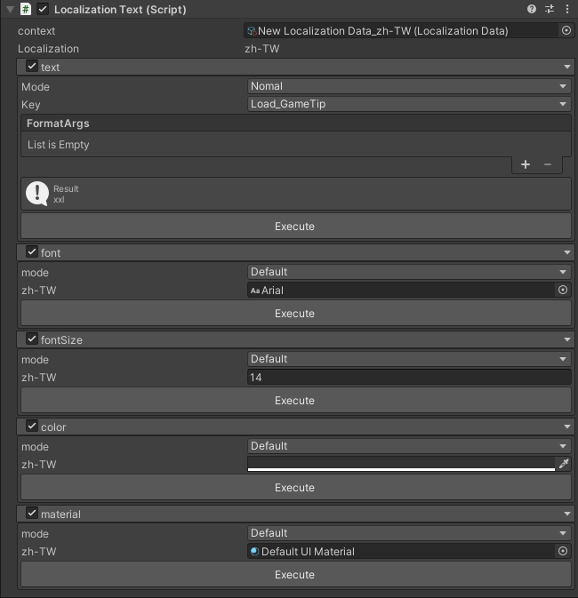

# 初始化
在游戏启动脚本中进行初始化：
``` csharp
using WooLocalization;
using UnityEngine;
public class LocalizationInitializer : MonoBehaviour
{
    public LocalizationData localizationData; // 赋值你的本地化数据
    private void Start()
    {
        // 设置记录器（用于保存当前语言设置）
        Localization.SetRecorder(new DefaultRecorder());
        // 设置本地化数据源
        Localization.SetContext(localizationData);
        // 设置默认语言
        Localization.SetDefaultLocalizationType(Languages.zh_CHS);
    }
}
```

# 创建本地化数据
在 Project 窗口右键创建LocalizationData文件并配置数据

# 添加本地化组件
给 UI 文本组件添加 LocalizationText 或 LocalizationTMP_Text 组件

# Text/TMP 组件
  * Context 设置文件
  * Text  
    * mode  
      * 1.Normal：无操作 
      * 2.New Key：输入Key和Value后点击Execute可以更新 
      * 3.Replace Value：重新修改当前key的值
    * Preview 当前语言的Key与Value
  * key
    * 此组件的key
  * FormatArgs 
    * 添加占位符的内容
  * Font
    * 设置字体
  * FontSize 
    * 设置字体大小
  * Color 
    * 设置文字颜色
  * Material
    * 设置材质球
  * 每个属性中的mode选项
    * 1.default ：默认资源配置
    * 2.Custom : 
    * 3.Asset : 配置此资源的Asset文件
