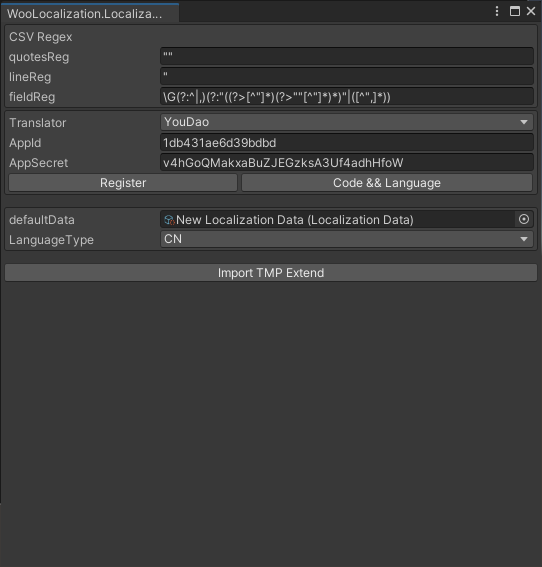
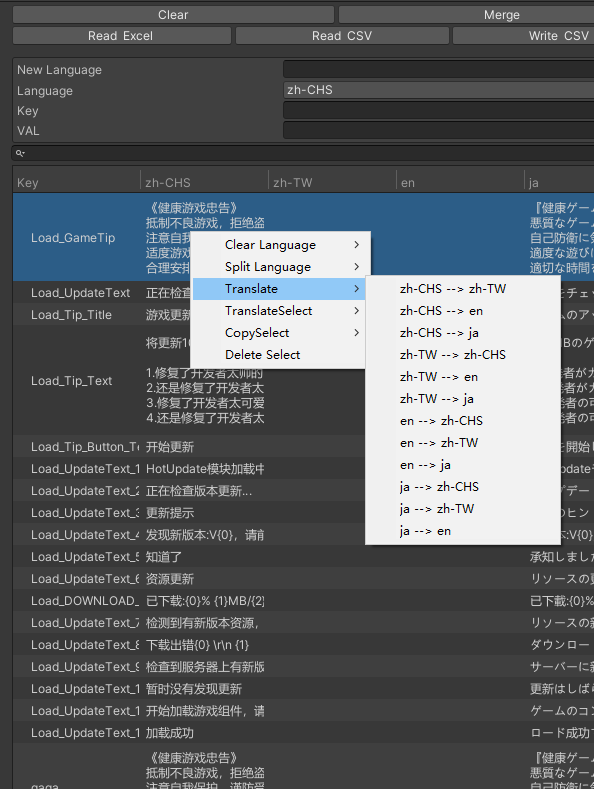

# GenKeys
点击后生成key、sprite、Languages的字段和方法脚本

# Localization Window
* CSVRegex
  * 正则表达式相关内容
* Translator
  * 有道翻译
  * 点击跳转有道界面注册登录 并申请应用获取id sercet 输入Appid 和AppSecret 
* DefaultData
  * 设置语言映射和语言
* ImportTMPExtend
  * 添加TMP相关脚本

# 使用有道翻译

* 点击Register跳转注册 点击Code&Language跳转Api接入界面 
* 填入Appid和AppSecret
* 选择Data文件右键 点击Translate 中指定语言全部翻译

