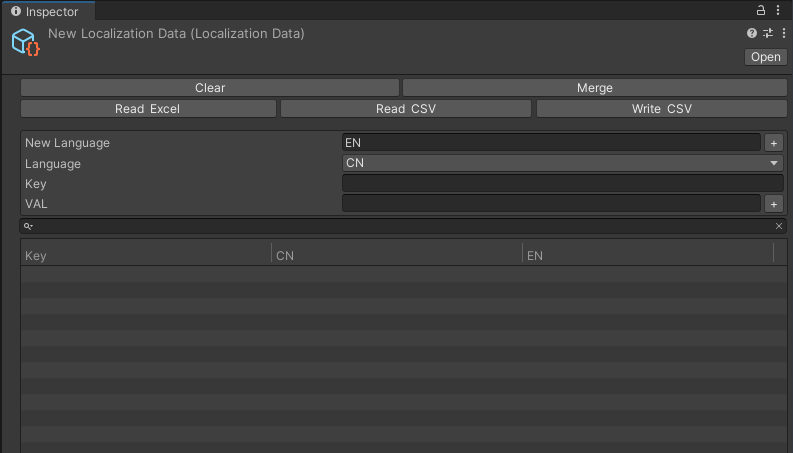

# 创建方法
右键Project窗口 - Creat - Localization Data

# 界面功能介绍
* Clear Data
  * 一键清除所有数据
* Merge
  * 合并选择的LocalizationData文件
* Read Excel
  * 从Excel文件夹中读取数据
* Read From CSV / Write to CSV 
  * 从本地路径中读写CSV文件
* NewLanguage 
  * 添加新语言
* Language
  * 选择语言
* Key
  * 用于在代码中引用对应文本的标识符
* VAL 
  * 用于在所需语言中显示的实际文本

# 其他类型资源文件 
Color、Font、Float等数据内容都可通过创建不同类型文件进行配置

