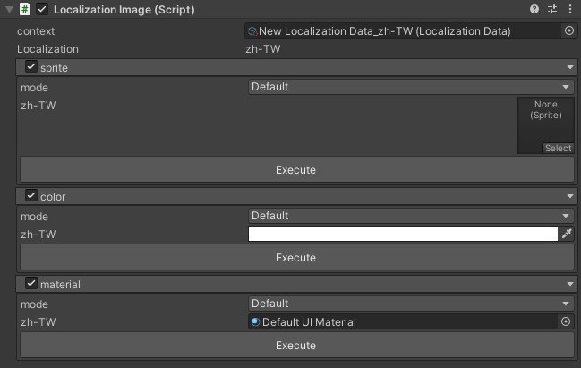
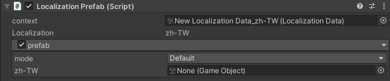

# Text/TMP 组件
  * Context 设置文件
  * Text  
    * mode  
      * 1.Normal：无操作 
      * 2.New Key：输入Key和Value后点击Execute可以更新 
      * 3.Replace Value：重新修改当前key的值
    * Preview 当前语言的Key与Value
  * key
    * 此组件的key
  * FormatArgs 
    * 添加占位符的内容
  * Font
    * 设置字体
  * FontSize 
    * 设置字体大小
  * Color 
    * 设置文字颜色
  * Material
    * 设置材质球


# Image 组件
  * Context 设置文件
  * Sprite
    * 设置sprite
  * Color 
    * 设置图片颜色
  * Material
    * 设置材质球



# Prefab 组件
  * Context 设置文件
  * Prefab
    * 设置不同语言要加载的预制体



# 如何不使用组件也能使用本地化功能
``` csharp
//调用静态类获取信息
text.text=Localization.GetLocalization("Key")
``` 